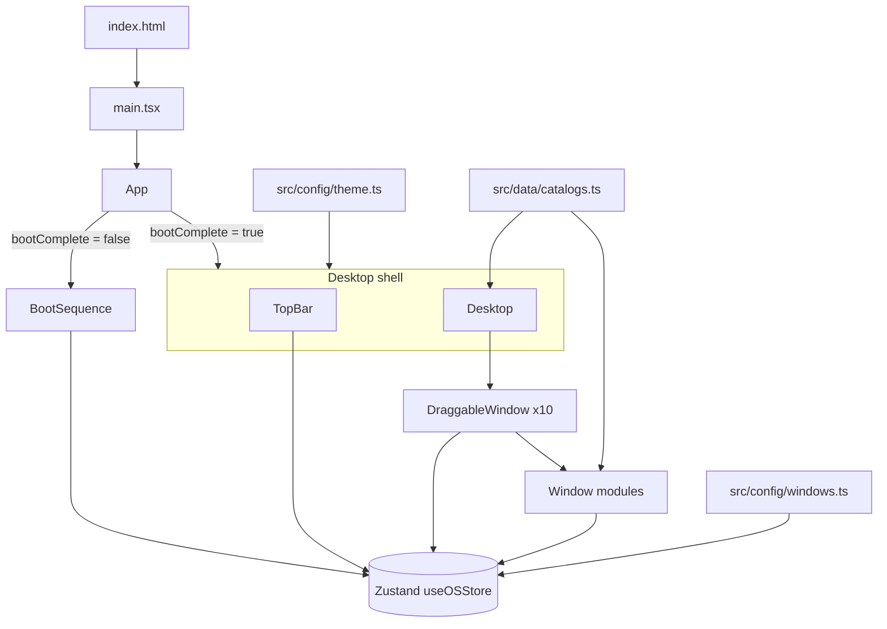
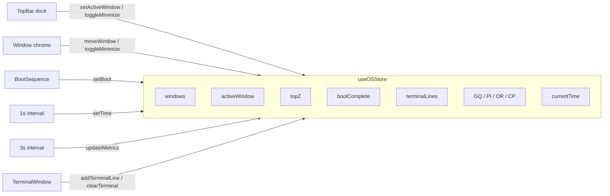

# Architecture — DAEDALUS // OS

DAEDALUS is a **single-page, client-only** simulation of a polymathic operating system. There is no server, no database, and no model API. The aesthetic of institutional omniscience is produced entirely in the browser: typed boot copy, window chrome, drifting telemetry, and two Canvas 2D animation loops.

Created by Zazie Productions.

## System overview

The runtime is a Vite + React 19 tree. Global OS state lives in one Zustand store. Window *contents* keep their own local React state. Static scholarly corpora (quotes, books, hexagrams, palettes) are modules, not fetches.

## Component / module boundaries

| Layer | Path | Responsibility |
| --- | --- | --- |
| Boot | `src/components/BootSequence.tsx` | Types the BIOS dump, then calls `setBoot(true)`. |
| Shell | `src/components/TopBar.tsx` | Clock, hour-phase greeting, dock, theatrical metrics. |
| Desktop | `src/components/Desktop.tsx` | Background field, quote watermark, window mount list. |
| Window manager | `src/components/DraggableWindow.tsx` | Drag, z-order, minimize/restore, accent chrome. |
| Modules | `src/components/windows/*` | Ten self-contained tools. |
| OS state | `src/lib/store.ts` | Frames, boot flag, terminal buffer, metrics. |
| Commands | `src/lib/terminal.ts` | Pure command table for `νοῦς`. |
| Catalogs | `src/data/*` | Diegetic corpora. |
| Theme / layout | `src/config/*` | Palette, default frames, accents. |

`react-router-dom` is **not** used. There is one route: the desktop.

## State flow

**What is global:** window frames (position, size, z-index, minimized), which window is focused, boot completion, the terminal scrollback, the four metric numbers, wall-clock time.

**What is local:** terminal input and history, library search/favorites, synth prompt index, manifesto text, oracle result, chronos index, lexicon expansion, moodboard selection, cortex active node, graph physics.

Favorites, manifesto text, and terminal history **do not persist**. Reload is a cold boot.

Query flags (read once at store init):

- `?skipBoot=1` or `?boot=skip` — skip the BIOS dump (used by screenshot capture).

## Rendering pipeline

1. **Boot.** `setInterval` at 90ms appends lines from `src/data/boot.ts`. Framer Motion fades the overlay out. This is copy, not a kernel.
2. **Shell.** Top bar is `position: fixed; z-index: 999`. Desktop is a full-viewport field with:
   - SVG neural lattice (`public/images/neural-bg.svg`)
   - phosphor / violet radial washes
   - CRT-style scanlines
   - 40px construction grid
   - a rotating quote at ~8% white
3. **Windows.** Absolutely positioned. Active window gets a brighter accent border and a larger glow. Title-bar `mousedown` records an offset; `window.mousemove` writes `x/y` through `moveWindow`, which clamps below the 52px top bar.
4. **Canvas modules.**
   - **Cortex Mapper** — `requestAnimationFrame` loop. Translucent `fillRect` leaves a phosphor trail. Nodes orbit a few pixels; edges pulse. Active discipline is highlighted in coral.
   - **Knowledge Graph** — tiny force simulation (center gravity, pairwise repulsion, mouse attraction, damping). Hover brightens a node. Graph topology is rolled once on mount.

Minimize unmounts the window component, which **cancels** its rAF loop. That is the main performance gate: only visible canvases run.

## Audio / data flow

There is **no audio graph**. The boot line `[AUD] Synesthetic audio processor: ONLINE` is diegetic fiction.

There is **no network data flow** after the HTML/JS/font assets load. Clipboard writes (synth COPY) are the only outbound browser I/O besides the initial page load.

Randomness is `Math.random()`:

- metrics random-walk every 3s
- oracle / haiku / quote / matrix / glitch / cross-pollination / graph edges / synapse radii
- desktop watermark quote every 30s

This is procedural atmosphere, not seeded reproducibility.

## Browser APIs actually used

| API | Where | Why |
| --- | --- | --- |
| Canvas 2D | Cortex, Graph | Procedural visualization |
| `requestAnimationFrame` | Cortex, Graph | Animation loops |
| `ResizeObserver` | Cortex | Fit canvas to window body |
| `setInterval` / `setTimeout` | Boot, TopBar, Synth, Oracle, Manifesto | Cadence and fake latency |
| Pointer / mouse events | DraggableWindow, Graph | Drag and force attraction |
| `navigator.clipboard` | Synth | Copy ideation prompt |
| `Date` / `toLocaleTimeString` | TopBar | Clock and hour-phase greeting |
| `URLSearchParams` | store init | Skip-boot flag |
| CSS `backdrop-filter` | Window chrome | Frosted institutional glass |

Not used: Web Audio, WebGL, Workers, WebSocket, Service Worker, IndexedDB, localStorage, history API.

## External dependencies

Runtime:

- **react / react-dom 19** — view tree
- **zustand 5** — OS store
- **framer-motion 12** — boot fade, window enter
- **lucide-react** — dock and module glyphs
- **tailwindcss 4** via `@tailwindcss/vite` — utility layout

Fonts: JetBrains Mono, self-hosted via `@fontsource/jetbrains-mono` (Latin, Greek, Cyrillic). Oracle hexagram glyphs in CJK depend on the host OS font fallback.

Dev/tooling: Vite 7, TypeScript 5.9, ESLint, Vitest, Playwright (screenshot capture only).

## Performance decisions

- **Two canvases, not ten.** Only Cortex and Graph animate. Everything else is React + CSS.
- **Trail via alpha fill** instead of storing particle history.
- **Force graph n ≈ 16.** Pairwise repulsion is O(n²) and cheap at this scale. No quadtree.
- **Terminal scrollback capped at 50 lines** (`slice(-50)`).
- **Zustand selectors** in TopBar/DraggableWindow so metric ticks do not rebuild every window body.
- **Minimize unmounts.** Hidden canvases do not run.
- **No router, no code splitting.** The whole OS is one bundle; that is appropriate for a 10-window toy desktop.

## Limitations and technical compromises

These are real, not roadmap poetry:

1. **Desktop-authored layout.** Default frames assume ~1440×900. Narrow viewports overlap windows. This is an OS simulation, not a responsive app.
2. **Maximize is chrome only.** The button is labeled `MAXIMIZE // OFFLINE`. There is no resize handle and no maximize pipeline.
3. **Close ≡ minimize.** Processes are never destroyed; the store always holds ten frames. On-brand, but not a real WM.
4. **Save does not save.** Manifesto SAVE is a 2s acknowledgement. Favorites are in-component `Set` state.
5. **Metrics are noise.** GQ / PI / OR / CP are bounded random walks. They are not derived from interaction.
6. **Graph hover used to restart physics.** Hover state was in a `useEffect` dependency and would re-seed the graph. Hover now lives on a ref so the simulation is stable.
7. **Mouse-only drag.** No pointer-capture / touch path.
8. **Oracle is a curated deck, not the I Ching.** Eight hexagrams, eight Major Arcana. Uniform `Math.random()`.
9. **Boot audio / neural substrate / 847 TB** are fiction. Do not document them as capabilities.
10. **GitHub Pages subdirectory.** Production `base` is `/DAEDALUS-V.1/`. Asset URLs must go through Vite `base` / `import.meta.env.BASE_URL`.

## What produces the aesthetic

The piece reads as a hostile-institutional cybernetic archive because of **constraints**, not because of extra features:

- monospace everywhere, phosphor `#00ff88` on void `#0a0a14`
- windows that cannot be killed, only suspended
- telemetry that looks official and means nothing
- a boot log that claims a synesthetic audio processor the code does not implement
- catalogs of untranslatable words, deep-time events, and books that never leave the client
- two living graphs whose motion is leftover phosphor, not data science

The OS is a stage. The tools are props that actually work.
