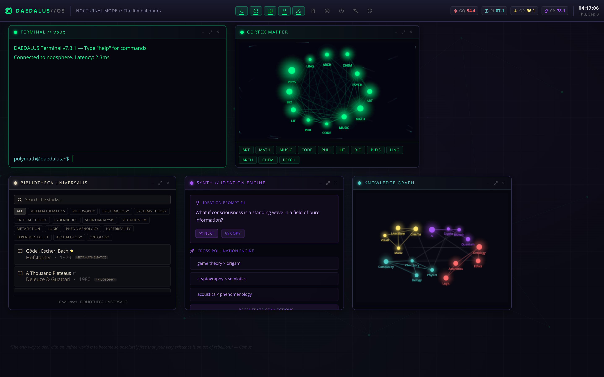
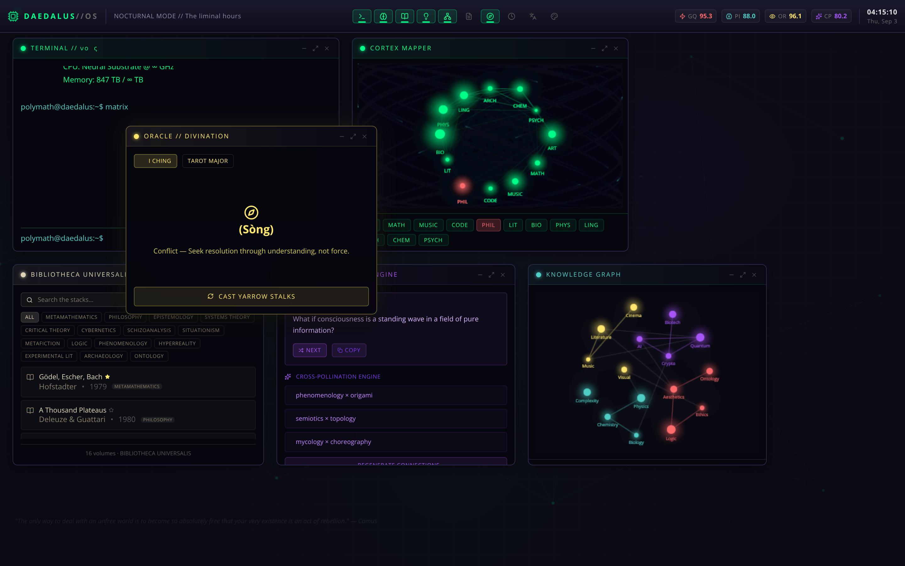
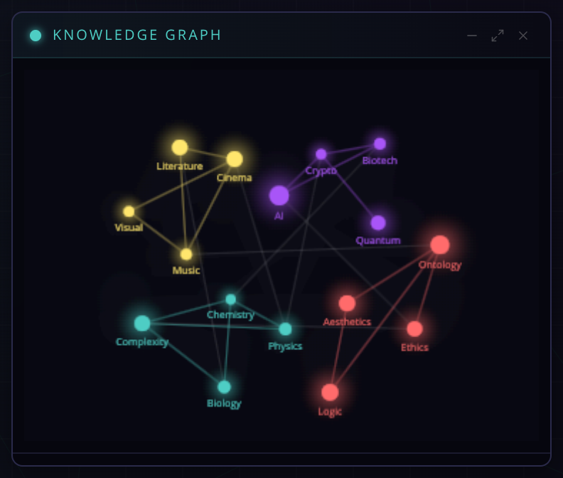

# DAEDALUS // OS

A browser-native polymathic operating system: windowed tools, procedural graphs, and diegetic telemetry for interdisciplinary thought.

**Created by Zazie Productions**

<p align="center">
  <a href="https://zazieproductions.github.io/DAEDALUS-V.1/">
    
  </a>
</p>

<p align="center">
  <a href="https://zazieproductions.github.io/DAEDALUS-V.1/"><strong>Launch Live Project</strong></a>
</p>

<p align="center">
  <a href="https://zazieproductions.github.io/DAEDALUS-V.1/"></a>
</p>

<p align="center">
  
  
  
  
  
  
  
  
</p>

> **Silent interface.** No Web Audio graph is attached. The boot log’s `[AUD] Synesthetic audio processor: ONLINE` is fiction. Use a **desktop viewport** (~1440×900); this is an OS simulation, not a responsive app.

---

## What this is

DAEDALUS is a **hostile-institutional desktop**: a phosphor terminal, a dock of hermetic tools, and two living graphs that pretend to be a nervous system. The operator boots into a machine that claims 847 TB of semantic memory and then offers a library of sixteen books, an oracle of eight hexagrams, and a manifesto that cannot actually be saved.

The aesthetic is produced by **constraints** — windows that refuse to die, telemetry that means nothing, catalogs that never leave the client — not by a hidden model API.

**Live deployment:** [https://zazieproductions.github.io/DAEDALUS-V.1/](https://zazieproductions.github.io/DAEDALUS-V.1/)

GitHub Pages is the intended host. First enable: **Settings → Pages → Build and deployment → Source: GitHub Actions**. The workflow [`.github/workflows/pages.yml`](.github/workflows/pages.yml) publishes `dist/` with `BASE_PATH=/DAEDALUS-V.1/`. Until that toggle is on, the URL above 404s even though CI already builds the artifact.

## Field notes

<p align="center">
  <a href="https://zazieproductions.github.io/DAEDALUS-V.1/">
    
  </a>
</p>

<p align="center">
  <a href="https://zazieproductions.github.io/DAEDALUS-V.1/">
    
  </a>
</p>

## What is actually running

| State | Surface |
| --- | --- |
| **Working** | Boot dump, window drag / focus / minimize, dock, clock + hour-phase greeting, terminal commands, cortex map, library search, synth prompts + clipboard, knowledge-graph physics, oracle draw, chronos navigator, lexicon, moodboard palettes |
| **Partial** | Maximize button (chrome only), Close = minimize, manifesto SAVE (acknowledgement, no disk), library stars (session only) |
| **Fiction / absent** | Audio processor, neural substrate, noosphere network, persistence, accounts, routing |

Full honesty tables: [docs/technical/window-modules.md](docs/technical/window-modules.md).

## Modules

Ten windows. Five mount on boot (terminal, cortex, library, synth, graph). Five start suspended.

- **TERMINAL // νοῦς** — `help`, `quote`, `status`, `think`, `whoami`, `neofetch`, `matrix`, `haiku`, `glitch`, `clear`
- **CORTEX MAPPER** — discipline nodes, phosphor trails
- **BIBLIOTHECA UNIVERSALIS** — sixteen volumes, field filters
- **SYNTH // IDEATION ENGINE** — prompts + domain cross-pollination
- **KNOWLEDGE GRAPH** — 16-node force layout, mouse gravity
- **MANIFESTO EDITOR** — in-memory tract
- **ORACLE // DIVINATION** — I Ching subset / Major Arcana subset
- **CHRONOS // DEEP TIME** — 17 events from −2600 to 2024
- **LEXICON OBSCURA** — untranslatable concepts
- **MOODBOARD // ΑΙΣΘΗΣΙΣ** — authored palettes + generative hex

## Run locally

```bash
npm ci
npm run dev
```

Open the URL Vite prints. Append `?skipBoot=1` to skip the BIOS dump.

```bash
npm run typecheck
npm run lint
npm test
npm run build
npm run preview
```

Production on GitHub Pages uses `BASE_PATH=/DAEDALUS-V.1/`. Local builds keep `base = /`.

## Screenshots

```bash
npx playwright install chromium
npm run build
npm run capture
```

Script: [`scripts/capture-screenshots.mjs`](scripts/capture-screenshots.mjs).

## Documentation

| Document | Role |
| --- | --- |
| [ARCHITECTURE.md](ARCHITECTURE.md) | System design, state, rendering, APIs, limits |
| [docs/technical/](docs/technical/) | Shell, modules, canvas, catalogs |
| [ROADMAP.md](ROADMAP.md) | What is not built |
| [CHANGELOG.md](CHANGELOG.md) | 1.0.0 archive pass |
| [CONTRIBUTING.md](CONTRIBUTING.md) | Aesthetic and engineering constraints |
| [SECURITY.md](SECURITY.md) | Client-only threat model |

## Stack

React 19 · TypeScript · Vite 7 · Zustand · Tailwind CSS 4 · Framer Motion · Canvas 2D · lucide-react · GitHub Pages

No backend. No router. No audio. Fonts: JetBrains Mono.

## License

© Zazie Productions. The work remains with the author unless a separate license is attached.
