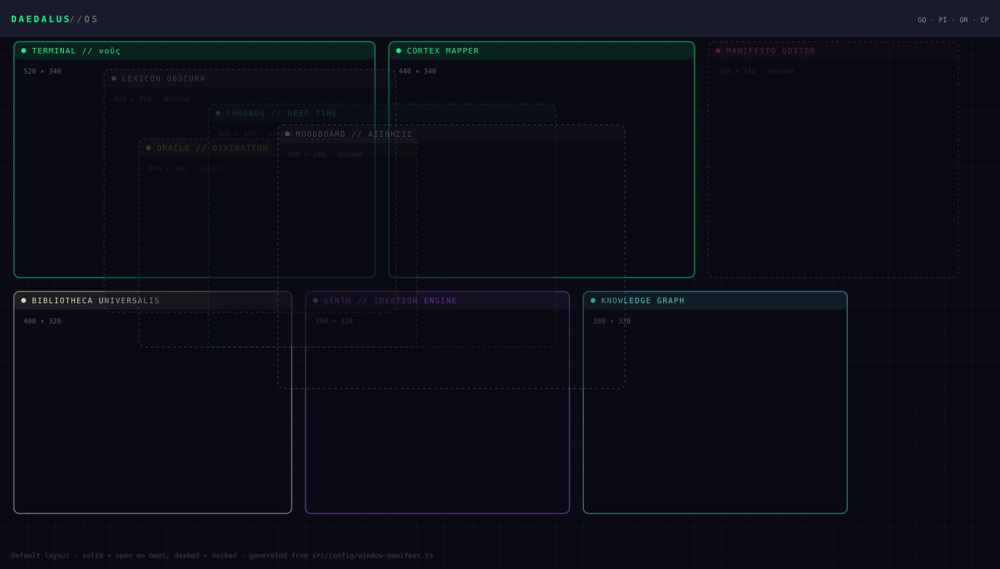
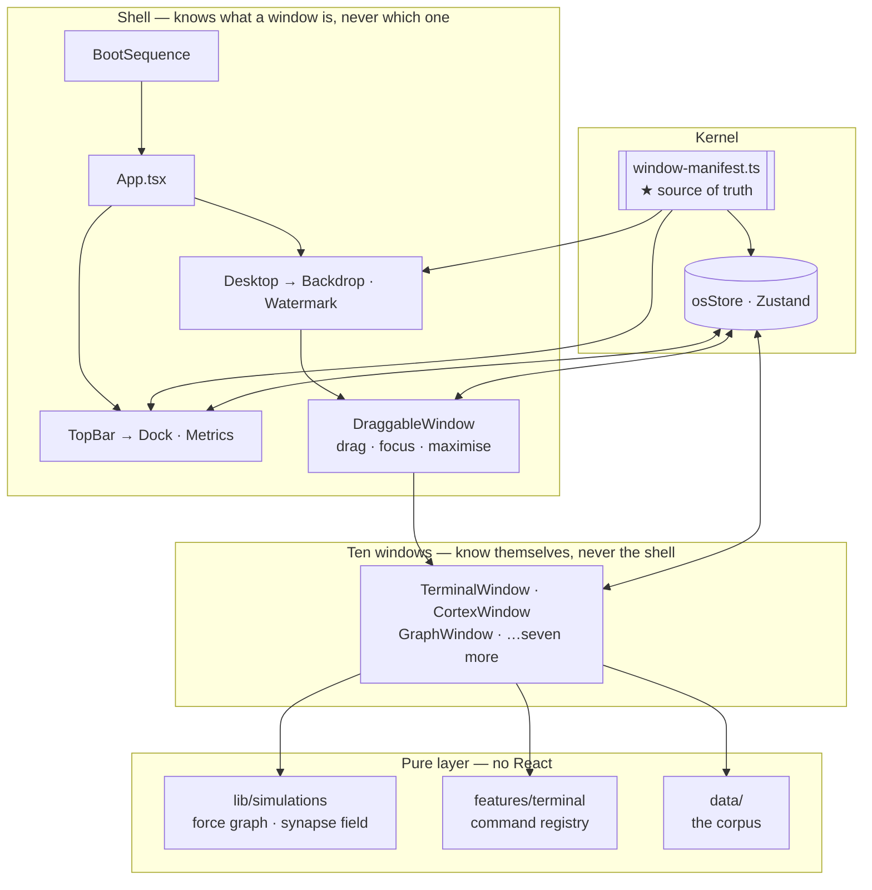

<div align="center">

# DAEDALUS // OS

**A polymathic operating system that never existed.**

A speculative desktop environment for cross-disciplinary thinking — ten windows,
a fictional shell, two live canvas simulations, and a BIOS that mounts
`/dev/imagination`.

[](https://github.com/zazieproductions/DAEDALUS-V.1/actions/workflows/ci.yml)
[](LICENSE)
[](https://react.dev)
[](tsconfig.app.json)
[](tests)
[](SECURITY.md)



<sub>The layout above is **generated from `src/config/window-manifest.ts`** by
`npm run docs:diagram`, and CI fails if it drifts. Solid = open on boot,
dashed = docked.</sub>

</div>

---

## Why it exists

Software interfaces encode a theory of how work happens. Every operating system
you have used was designed around _productivity_ — files, tasks, notifications,
completion.

DAEDALUS asks what a desktop would look like if it had been designed around
**synthesis** instead: an interface for someone whose actual job is noticing
that two unrelated fields are describing the same structure.

So the taskbar has an oracle in it. The filesystem mounts `/dev/intuition`. The
system metrics measure a "polymath index" that is entirely fictional and drifts
upward all session, because that is what a machine built to flatter a
generalist would do. The whole thing is an argument — about specialisation,
about combinatorial creativity, about interfaces as rhetoric — that happens to
compile.

It is also a serious piece of front-end engineering, and it is built to be read
as both.

## What it does

Boot the page and a BIOS prints itself, mounts several impossible devices, and
hands you a desktop environment running ten programs. You can drag, focus,
dock, maximise and restore windows; type into a shell; search a library; cast a
hexagram; scrub 4,600 years of intellectual history; and watch a force-directed
graph rearrange itself under your cursor.

There is no server, no account, no database and no telemetry. It boots clean
every time, on purpose.

### The ten windows

| Window                       | What it is                                                                                 | The claim it makes                                |
| ---------------------------- | ------------------------------------------------------------------------------------------ | ------------------------------------------------- |
| **TERMINAL // νοῦς**         | A shell with ten commands, history, and generated `help`. `neofetch` reports `∞ × ∞`.      | Ideas deserve a command line.                     |
| **CORTEX MAPPER**            | Twelve disciplines as a breathing synapse field on canvas, with distance-attenuated links. | The disciplines are one substrate.                |
| **BIBLIOTHECA UNIVERSALIS**  | Sixteen field-rewriting books, searchable and filterable by discipline.                    | A library is a compressed argument.               |
| **SYNTH // IDEATION ENGINE** | Curated provocations, plus a combinatorial engine that pairs deliberately distant fields.  | Novelty is combinatorial.                         |
| **KNOWLEDGE GRAPH**          | A live force simulation: 16 concepts, 4 faculties, inverse-square repulsion, pointer pull. | Knowledge is a network under tension, not a tree. |
| **MANIFESTO EDITOR**         | An editable eight-point statement of intent, with live word count.                         | A practice needs a position.                      |
| **ORACLE // DIVINATION**     | I Ching hexagrams and tarot major arcana, read as creative-practice guidance.              | Randomness with good taste beats a blank page.    |
| **CHRONOS // DEEP TIME**     | 2600 BCE → now on one rail, ending on a marker stamped with the current year.              | Ideas have ancestors.                             |
| **LEXICON OBSCURA**          | Untranslatable words — _apophenia_, _mono no aware_, _duende_ — as an accordion.           | Vocabulary is a constraint on cognition.          |
| **MOODBOARD // ΑΙΣΘΗΣΙΣ**    | Eight movement palettes set against a purely random one.                                   | Colour is an argument.                            |

## Key capabilities

Things here that are less ordinary than they look:

- **A registry-driven window manager.** Drag (pointer events, with capture),
  focus stacking, docking, maximise/restore with lossless geometry, and
  clamping that makes it impossible to lose a window off-screen. Every window
  is declared once, as data; the shell contains no window-specific code at all.
  → [`docs/window-system.md`](docs/window-system.md)
- **Two real simulations, unit-tested without a canvas.** A force-directed
  layout (centre gravity + inverse-square repulsion + pointer attraction,
  damped) and an animated synapse field with de-phased pulse propagation. The
  physics is pure, injectable-RNG, and asserted against runaway values,
  coincident-node singularities, and energy decay.
  → [`docs/simulations.md`](docs/simulations.md)
- **A shell whose `help` cannot go stale.** Commands are a registry of pure
  functions; the help box is rendered from the same table that dispatches them,
  padded to a computed width. A faulting command reports in-band rather than
  taking the window down.
  → [`docs/terminal.md`](docs/terminal.md)
- **Documentation generated from source.** `npm run docs:diagram` renders the
  layout SVG at the top of this file from the window manifest. CI fails the
  build if the committed diagram no longer matches the code.
- **Honest fake telemetry.** Four bounded random walks with per-metric
  volatility and an upward bias — documented as fiction in the source, and
  tested to stay inside their bounds under a thousand adversarial ticks.
- **A corpus that is data, not code.** ~100 authored fragments live in
  `src/data/` behind typed interfaces, with integrity tests. You can extend the
  writing without reading a component.
- **Animation that respects the operator.** HiDPI-correct canvases,
  frame-rate-independent timing, and a full `prefers-reduced-motion` path.

## Demo

There is no hosted instance yet. It runs locally in under a minute:

```bash
git clone https://github.com/zazieproductions/DAEDALUS-V.1.git
cd DAEDALUS-V.1 && npm install && npm run dev
```

A manual-dispatch GitHub Pages workflow is included and configured for project
sites — see [`docs/deployment.md`](docs/deployment.md).

**Try these first:** type `help`, then `neofetch`, then `glitch YOUR NAME` in
the terminal · drag the knowledge graph around with your cursor · open ORACLE
from the dock and cast · double-click any title bar to maximise.

## Architecture



One inversion carries the whole design: **the shell knows what a window _is_,
never what any particular window _does_.** `Desktop` is a `.map()` over a
manifest; no shell component contains the string `"terminal"`. Windows take no
props and never import the shell.

Full detail — layers, data flow, render clocks, module-boundary table — in
[`docs/architecture.md`](docs/architecture.md).

## Quick start

```bash
npm install     # Node 20.19+ or 22+
npm run dev     # http://localhost:5173
```

Impatient? Press any key to skip the boot sequence, or put
`VITE_SKIP_BOOT=true` in `.env.local`.

## Installation

**Requirements:** Node **20.19+** or **22+** (Vite 7's floor; `.nvmrc` pins 22),
npm 10+. No global tooling, no native modules, no services.

```bash
git clone https://github.com/zazieproductions/DAEDALUS-V.1.git
cd DAEDALUS-V.1
npm ci                 # reproducible install from the lockfile
cp .env.example .env.local   # optional — every variable has a default
npm run validate       # format · lint · types · tests · build
```

## Usage

| Action                 | How                                                      |
| ---------------------- | -------------------------------------------------------- |
| Skip the boot sequence | Click, or press any key                                  |
| Focus a window         | Click anywhere on it                                     |
| Move a window          | Drag its title bar (mouse, touch or stylus)              |
| Dock a window          | The `–` or `✕` control, or its dock button while open    |
| Restore a window       | Its dock button in the top bar                           |
| Maximise / restore     | The maximise control, or double-click the title bar      |
| Run a command          | Type in TERMINAL; `↑`/`↓` walk history; `help` lists all |

Windows are never destroyed — `✕` returns them to the dock, because the fiction
says these programs are always running.

## Configuration

Every variable is optional and build/dev-time only. There is no server and no
secret anywhere in the project. See [`.env.example`](.env.example).

| Variable             | Default | Purpose                                                                |
| -------------------- | ------- | ---------------------------------------------------------------------- |
| `VITE_SKIP_BOOT`     | `false` | Skip the ~3 s BIOS animation. Set it while iterating on a window.      |
| `VITE_BASE_PATH`     | `/`     | Serve from a sub-path, e.g. `/DAEDALUS-V.1/` for a Pages project site. |
| `VITE_ALLOWED_HOSTS` | —       | Comma-separated dev-server hostnames to trust (cloud IDEs, proxies).   |

All three are read once, in [`src/config/env.ts`](src/config/env.ts), which
validates them and warns on nonsense instead of failing silently. No component
touches `import.meta.env` directly.

Design tokens live in [`src/config/theme.ts`](src/config/theme.ts), mirrored in
`src/styles/global.css` for Tailwind — with a test that fails if the two drift.

## Project structure

```
.
├── src/
│   ├── main.tsx                  Entry point; fails loudly if #root is missing
│   ├── App.tsx                   Boot ⇄ desktop. The entire "routing" of the app
│   ├── config/
│   │   ├── window-manifest.ts    ★ Source of truth: what windows exist
│   │   ├── windows.ts            Manifest bound to React components
│   │   ├── metrics.ts            The four fake readouts and their random walk
│   │   ├── theme.ts              Design tokens
│   │   └── env.ts                Typed, validated environment access
│   ├── store/osStore.ts          The kernel: one Zustand store
│   ├── components/
│   │   ├── boot/                 BIOS sequence
│   │   ├── shell/                Top bar · dock · metrics · desktop · backdrop
│   │   └── window/               Window chrome: drag, focus, maximise
│   ├── windows/                  The ten windows, one file each
│   ├── features/terminal/        Command registry — pure, React-free
│   ├── data/                     The corpus: quotes, books, lexicon, decks…
│   ├── lib/                      Pure functions
│   │   └── simulations/          Force-directed graph · synapse field
│   ├── hooks/                    Canvas loop · interval · motion preference
│   ├── types/                    The type vocabulary
│   └── styles/global.css         Tailwind entry, tokens, keyframes
├── tests/
│   ├── unit/                     Pure logic — no DOM
│   └── integration/              Behavioural, via Testing Library
├── tools/                        Diagram generator · clean script
├── docs/                         Architecture, methodology, ADRs, media
├── public/                       Favicon, desktop wallpaper
└── .github/workflows/            CI · manual Pages deploy
```

## Development

```bash
npm run dev            # dev server with HMR
npm run validate       # what CI runs: format → lint → types → tests → build
npm run test:watch     # Vitest in watch mode
npm run docs:diagram   # regenerate the layout diagram from the manifest
```

Adding a window is a three-step change — component, `WindowId` union, manifest
entry — and the type system refuses to compile a half-finished one. The dock,
desktop, store, tests and layout diagram all pick it up automatically.
Walkthrough: [`docs/window-system.md`](docs/window-system.md).

Conventions, scripts and the full workflow:
[`docs/development.md`](docs/development.md) and
[`CONTRIBUTING.md`](CONTRIBUTING.md).

## Testing

**100 tests**, split by what they are protecting:

```bash
npm test              # single run
npm run test:coverage # V8 coverage → coverage/
```

- **Unit** — the physics (bounds, energy decay, coincident-node singularities),
  window geometry clamping, metric walks under adversarial RNG, the command
  registry, corpus integrity, and design-token drift.
- **Integration** — the desktop as a user meets it: the dock renders one
  launcher per window, docking and restoring work from both chrome and dock,
  maximise round-trips geometry exactly, the terminal answers and recalls
  history, the library filters as you type.

Two standing rules: assert behaviour by accessible role and name, never markup;
and inject randomness, so anything stochastic is deterministic under test and
genuinely random at runtime.

CI additionally regenerates the layout diagram and fails if the committed SVG
is stale — documentation that cannot silently rot.

## Troubleshooting

| Symptom                                      | Cause and fix                                                                                          |
| -------------------------------------------- | ------------------------------------------------------------------------------------------------------ |
| `Blocked request. This host is not allowed.` | Vite's DNS-rebinding guard. Add the host to `VITE_ALLOWED_HOSTS`.                                      |
| Canvases are blank                           | No 2D context; check the console for `[daedalus/canvas]`. The rest still works.                        |
| Nothing animates                             | Your OS requests reduced motion, which the app honours.                                                |
| A window "disappeared"                       | It is docked — windows cannot leave the screen. Check the dock.                                        |
| Manifesto edits lost on reload               | By design; nothing is persisted. See [ADR 0002](docs/decisions/0002-zustand-kernel-no-persistence.md). |
| Wrong typeface                               | The Google Fonts request was blocked; it falls back to system monospace.                               |

Longer list: [`docs/troubleshooting.md`](docs/troubleshooting.md).

## Roadmap

Kept in three honest tiers in [`docs/roadmap.md`](docs/roadmap.md) — nothing is
described as if it already exists.

- **Shipped** — everything documented above.
- **Planned** — window resizing, opt-in session persistence, keyboard window
  management, a seeded reproducible session, visual regression tests.
- **Speculative** — sonifying the knowledge graph via Web Audio; inter-window
  pipes (`cortex | synth`); a browsable `/dev/imagination`; a printed edition
  typeset from the same corpus modules.
- **Explicitly not planned** — a backend, a component library, real metrics, a
  phone layout. Each with a reason.

## Contributing

Contributions are welcome, judged on two axes: does it work, and does it
belong. [`CONTRIBUTING.md`](CONTRIBUTING.md) covers setup, conventions, the
three-step window recipe, and the ground rules — chief among them that the
intentional strangeness is the point, and "fixing" it needs a conversation
first.

- Bug reports and window proposals: [issue templates](.github/ISSUE_TEMPLATE)
- Code of conduct: [`CODE_OF_CONDUCT.md`](CODE_OF_CONDUCT.md)
- Security and privacy posture: [`SECURITY.md`](SECURITY.md)
- Decision history: [`docs/decisions/`](docs/decisions)

## License

[MIT](LICENSE) © zazieproductions.

The quotations in `src/data/quotes.ts` are short attributed excerpts used as
epigraphs; all other text in the corpus is original to this project.

---

<div align="center">
<sub><i>"I must create a system, or be enslav'd by another man's." — Blake</i></sub>
</div>
