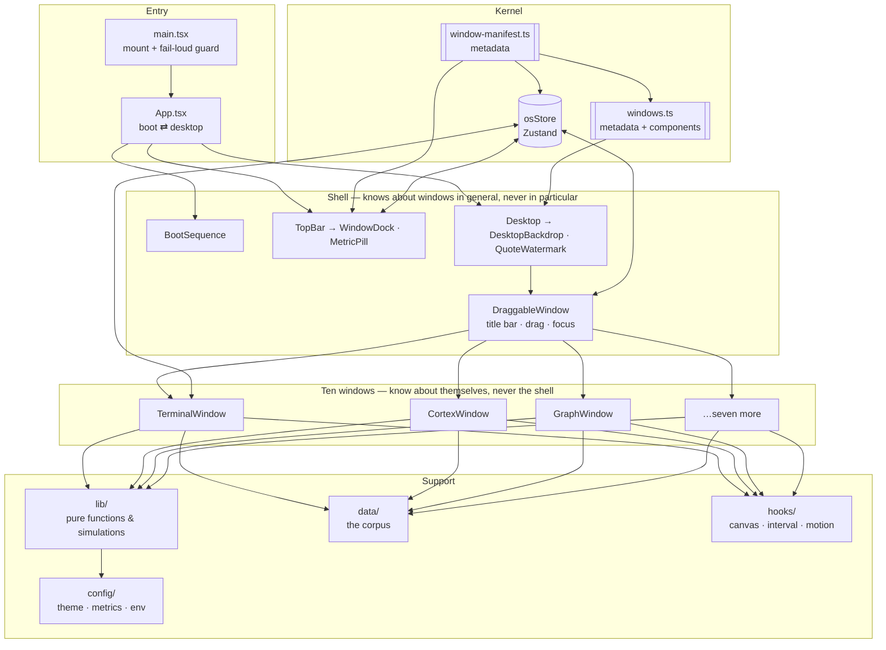
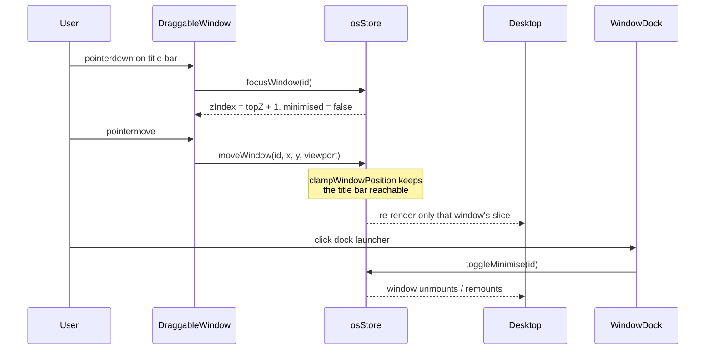

# Architecture

DAEDALUS // OS is a single-page, client-only React application that impersonates
a desktop operating system. There is no server, no router and no persistence:
the whole machine lives in one browser tab and boots from zero every time.

The architecture exists to support one property above all others — **adding a
window should touch exactly three files, and nothing else in the system should
need to know it happened.**

## Layers



### The one rule

**The shell knows what a window _is_; it never knows what any particular window
_does_.** `Desktop` renders `WINDOW_REGISTRY.map(...)`. `WindowDock` renders
`WINDOW_MANIFEST.map(...)`. Neither contains the string `"terminal"`. Windows,
symmetrically, receive no props and never import the shell.

That inversion is what makes the system extensible: everything the shell needs
is declared as data, in one array.

## Directory layout

```
src/
├── main.tsx                 Entry point; mounts React, fails loudly if #root is gone
├── App.tsx                  Boot ⇄ desktop switch. The entire "routing" of the app
│
├── config/                  Declarative configuration — no behaviour
│   ├── window-manifest.ts   ★ Source of truth: what windows exist
│   ├── windows.ts           Manifest bound to React components
│   ├── metrics.ts           The four fake telemetry readouts and their random walk
│   ├── theme.ts             Design tokens, mirrored in styles/global.css
│   └── env.ts               Typed, validated environment access
│
├── store/osStore.ts         The kernel: one Zustand store, all cross-window state
│
├── components/
│   ├── boot/                BIOS sequence
│   ├── shell/               Top bar, dock, metrics, desktop surface, backdrop
│   └── window/              Window chrome: drag, focus, maximise, controls
│
├── windows/                 The ten windows. One file each, no props, no shell imports
│
├── features/terminal/       Command registry — pure, React-free, unit-tested
│
├── data/                    The corpus: quotes, books, lexicon, timeline, decks…
│
├── lib/                     Pure functions
│   ├── simulations/         Force-directed graph, synapse field
│   ├── geometry.ts          Window clamping and maximise geometry
│   ├── random.ts            Injectable-RNG helpers (unbiased shuffle, pick, hex)
│   └── text.ts              Glitch corruption, circadian greeting, word count
│
├── hooks/                   useAnimationCanvas · useInterval · usePrefersReducedMotion
├── types/                   The type vocabulary
└── styles/global.css        Tailwind entry, tokens, keyframes, reduced-motion
```

`★` marks the file you will change most often.

## Data flow

Everything mutable funnels through one store. There is no context, no prop
drilling and no event bus.



Two details that matter:

- **Slice-level subscriptions.** Every component selects the narrowest slice it
  needs (`useOSStore((s) => s.windows[id])`). The clock ticks once a second; if
  components subscribed to the whole store, that tick would re-render all ten
  windows and both canvases sixty times a minute for nothing.
- **The viewport is passed in, not stored.** `moveWindow` and `toggleMaximise`
  take `{ width, height }` from the caller. Window size is a DOM fact, not
  application state, and mirroring it into the store would mean a resize
  listener, stale values and a second source of truth.

## Render and animation cycle

| Clock              | Rate     | Driver                                    | Touches                      |
| ------------------ | -------- | ----------------------------------------- | ---------------------------- |
| Boot printer       | 90 ms    | `setInterval` in `BootSequence`           | Boot overlay only            |
| System clock       | 1 s      | `useInterval` in `TopBar`                 | Clock readout                |
| Metric random walk | 3 s      | `useInterval` in `TopBar`                 | Four metric pills            |
| Quote rotation     | 30 s     | `useInterval` in `QuoteWatermark`         | Desktop watermark            |
| Canvas simulations | ~16.7 ms | `requestAnimationFrame` per canvas window | Canvas pixels only, no React |

The canvas loops never trigger a React render. Simulation state lives in refs;
the draw callback lives in a ref too, so a re-render from an unrelated part of
the app cannot tear down and restart an animation. See
[simulations.md](simulations.md).

## Module boundaries

| Layer                    | May import                       | Must not import              |
| ------------------------ | -------------------------------- | ---------------------------- |
| `lib/`, `data/`          | Each other, `config/theme`       | React, store, components     |
| `config/window-manifest` | `config/theme`, `types`, icons   | Components, store            |
| `config/windows`         | Manifest + window components     | —                            |
| `store/`                 | `config/window-manifest`, `lib/` | Components, `config/windows` |
| `windows/`               | Store, `lib/`, `data/`, `hooks/` | Shell components             |
| `components/shell/`      | Store, manifest, registry        | Individual window modules    |

The `store → window-manifest` (not `store → windows`) edge is deliberate: the
registry imports window components, and window components import the store, so
routing the store through the registry would close an import cycle. That bug
was hit during the restructure and is recorded in
[decisions/0001](decisions/0001-registry-driven-window-system.md).

## Dependencies, and why each is here

| Package         | Role                                                                    |
| --------------- | ----------------------------------------------------------------------- |
| `react` 19      | UI runtime.                                                             |
| `zustand` 5     | ~1 kB store. Selector subscriptions without context or a provider tree. |
| `framer-motion` | Window mount/unmount transitions and the boot fade.                     |
| `lucide-react`  | Icon set for the dock, chrome and window headers.                       |
| `tailwindcss` 4 | Layout and spacing utilities; colour comes from tokens, applied inline. |
| `vite` 7        | Dev server and build.                                                   |

No router (there are no routes), no data-fetching library (there is nothing to
fetch), no component library (the chrome is the design).

## What deliberately has no abstraction

Some duplication is load-bearing. Each window styles its own interior with
inline colours drawn from its accent, rather than sharing a component kit. That
is the point: the windows are supposed to feel like ten programs written by ten
people who agreed only on the window manager. A shared `<Panel>` component would
make the codebase tidier and the artefact worse.
