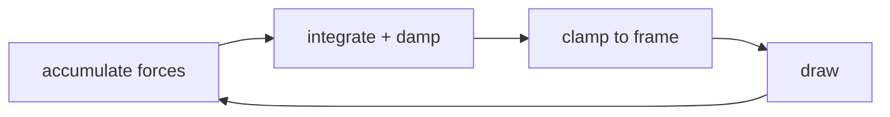

# Simulations

Three of the OS's systems are simulations rather than widgets: the knowledge
graph, the synapse field, and the telemetry random walk. All three are
implemented as **pure functions with injectable randomness**, separated from
their rendering, which is why they can be unit-tested without a canvas.

- `src/lib/simulations/force-graph.ts`
- `src/lib/simulations/synapse-field.ts`
- `src/config/metrics.ts`
- Tests: `tests/unit/simulations.test.ts`, `tests/unit/geometry-metrics.test.ts`

## Knowledge graph — force-directed layout

Sixteen concepts across four faculties, laid out live at frame rate. Three
forces, integrated with damping.



### The forces

**1. Centre gravity** — a weak linear spring toward the middle:

```
v += (centre − p) · k        k = 0.0005
```

Without it the mutual repulsion below would push the graph off-canvas within a
few seconds.

**2. Pairwise repulsion** — inverse-square, applied symmetrically:

```
F = (R / d²) · s             R = 50, s = 0.01
vᵢ += d̂ · F                  vⱼ −= d̂ · F
```

This is what produces the readable spacing. `d` is floored at 1 so two
coincident nodes cannot divide by zero and launch each other to infinity — an
edge case that is explicitly tested, because it is exactly the kind of thing
that only shows up in production.

At n = 16 the O(n²) pass is 120 pair tests per frame. A quadtree would be
faster asymptotically and slower in practice; no spatial index is warranted.

**3. Pointer attraction** — nodes within 80 px lean toward the cursor:

```
if |pointer − p| < 80:  v += (pointer − p) · 0.001
```

Weak on purpose. Enough that the graph acknowledges the hand; not enough to
drag it around.

### Integration

```
v *= 0.95                    # damping — the system loses energy and settles
p  = clamp(p + v, padding, size − padding)
```

Damping below 1 is what makes it settle instead of ringing forever; the
kinetic-energy decay is asserted in the tests. The clamp is a hard positional
constraint rather than a boundary force, which is cheaper and cannot overshoot.

The step is deliberately written in two phases — accumulate, then integrate —
so every node sees the same field, rather than the Gauss-Seidel behaviour you
get from mutating positions inside the pair loop.

### Rendering

Edges are drawn before nodes, cross-faculty edges faintest (`rgba(255,255,255,
0.06)` vs the source faculty's colour at 19%). That inversion is intentional:
the rarest links are the ones the manifesto claims matter most, and drawing
them quietly makes you look for them.

The canvas is never cleared. Each frame paints `rgba(10,10,20,0.2)` over the
previous one, which decays old pixels exponentially and leaves motion trails.

## Synapse field

Twelve disciplines on a jittered circle, drawn as a breathing network.

**Layout.** Equal angular spacing (`2πi / 12`) with a random radius in
[80, 120] around the canvas centre. Equal angles keep every label readable;
random radii stop it looking like a clock face.

**Link opacity** — distance falloff × a de-phased pulse:

```
α(d, t, i) = (1 − d / 200) · 0.3 · (0.5 + 0.5·sin(t + 0.5i))    for d < 200
           = 0                                                   otherwise
```

The `0.5i` phase offset per source node is the whole trick: without it every
link in the field pulses in unison and reads as a global fade. With it, the
field appears to breathe locally.

**Node motion.** Each node orbits its rest position on `sin(t + i)` / `cos(t + i)`
with a 3 px amplitude, and its radius pulses at `1 + 0.3·sin(2t + i)`. No
physics — a few sines are indistinguishable from life at this scale and cost
nothing.

**Motes.** Twenty particles on `sin(0.3t + 17i)` / `cos(0.2t + 13i)`. The
coefficients (0.3, 0.2, 17, 13) are mutually incommensurable, so the pattern
never visibly repeats.

## Frame timing

Both windows run through `useAnimationCanvas`, which solves three problems that
hand-rolled `useEffect` loops usually get wrong:

| Problem            | Symptom                                                   | Fix                                                                                                            |
| ------------------ | --------------------------------------------------------- | -------------------------------------------------------------------------------------------------------------- |
| HiDPI blur         | Canvas looks soft on retina displays                      | Backing store scaled by `devicePixelRatio` (capped at 2), context pre-scaled so drawing stays in logical units |
| Callback identity  | Animation restarts whenever any state changes             | `draw` is held in a ref; the effect depends only on size                                                       |
| Motion sensitivity | Perpetual animation with `prefers-reduced-motion: reduce` | One static frame instead of a loop                                                                             |

The hook reports **elapsed seconds**, not a frame count. The original code
advanced a counter by `0.02` per frame, which made the animation speed depend
on the display's refresh rate — the same scene ran twice as fast on a 120 Hz
panel. Multiplying seconds by `1.2` reproduces the original tempo at any
refresh rate.

## Telemetry as a bounded random walk

The four readouts in the top bar (GQ, PI, OR, CP) measure nothing. Each is a
random walk, re-sampled every three seconds:

```
value ← clamp(value + (random() − bias) · volatility, min, max)
```

| Metric           | Initial | Range     | Volatility | Bias | Character                    |
| ---------------- | ------: | --------- | ---------: | ---: | ---------------------------- |
| Genius quotient  |    94.7 | 80 – 99.9 |        0.8 | 0.45 | Twitchy, flattering          |
| Polymath index   |    87.3 | 70 – 99.9 |        0.6 | 0.45 | Steady climb                 |
| Obscurity rating |    96.1 | 85 – 99.9 |        0.4 | 0.48 | Nearly pinned at the ceiling |
| Creative pulse   |    78.5 | 60 – 99.9 |        1.2 | 0.40 | Volatile and optimistic      |

Because `bias < 0.5`, the expected step is positive — `E[Δ] = (0.5 − bias) ·
volatility` — so every number drifts upward over a session. The interface
flatters its operator, which is the joke, and each metric has a distinct
temperament so the four do not twitch in unison.

The clamps are load-bearing rather than cosmetic: the tests drive a thousand
adversarial ticks at each extreme and assert the values pin to their bounds
instead of running away.
