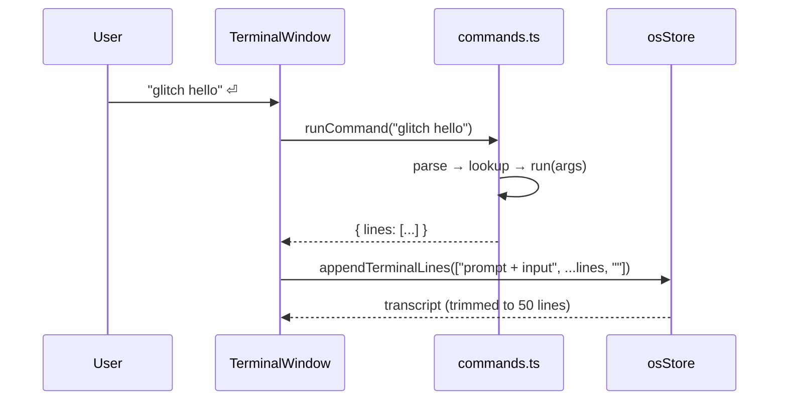

# The terminal

`TERMINAL // νοῦς` is a shell for a machine that runs on ideas. It has no
filesystem, no processes and no pipes — it has ten commands and an opinion.

## Command reference

| Command    | Output                                                                          |
| ---------- | ------------------------------------------------------------------------------- |
| `help`     | The box below. Generated from the command table, so it is never stale.          |
| `quote`    | One entry from the quote corpus.                                                |
| `status`   | Six lines of plausible-sounding diagnostics with randomised figures.            |
| `think`    | A provocation from `THOUGHTS`.                                                  |
| `clear`    | Wipes the transcript.                                                           |
| `whoami`   | Identity card: `UID: ∞`, `Shell: /bin/nous`, `Home: /dev/imagination`.          |
| `neofetch` | ASCII sigil beside a spec sheet for a machine that cannot exist.                |
| `matrix`   | Eight rows of sixty random katakana (U+30A0–U+30FF).                            |
| `haiku`    | One of three haiku about computation.                                           |
| `glitch`   | Corrupts its argument five times over. Defaults to `THE MEDIUM IS THE MESSAGE`. |

```
╔══════════════════════════════════════════════╗
║  DAEDALUS TERMINAL // Available Commands     ║
╠══════════════════════════════════════════════╣
║  help      — Display this message            ║
║  quote     — Channel the noosphere           ║
║  status    — System diagnostics              ║
║  think     — Generate a thought              ║
║  clear     — Clear terminal                  ║
║  whoami    — Identity query                  ║
║  neofetch  — System information              ║
║  matrix    — Enter the matrix                ║
║  haiku     — Generate a haiku                ║
║  glitch    — ▓░▒█▀▄                          ║
╚══════════════════════════════════════════════╝
```

Unknown input is answered in shell dialect:

```
nous: command not found: sudo
Type "help" for available commands.
```

## Interaction

- **Enter** runs the current line.
- **↑ / ↓** walk the command history (session-scoped, most recent first).
- The transcript keeps the last 50 lines and lives in the store, so it survives
  docking and restoring the window.
- Lines are colourised by kind: `[TAG]` output in dim green, echoed input in
  cyan, everything else in phosphor green.

## How it is built

The window component owns the input, the history and the scroll position. It
owns no command logic at all. Parsing and execution live in
`src/features/terminal/commands.ts`, a module with no React import:

```ts
export interface TerminalCommand {
  description: string; // shown in `help`
  run: (args: string[], context: CommandContext) => string[];
}

export const TERMINAL_COMMANDS: Record<string, TerminalCommand>;
export function runCommand(input: string, context?: CommandContext): CommandResult;
```

Three properties fall out of that shape:

1. **`help` cannot drift.** It is rendered from `TERMINAL_COMMANDS`, padded to
   a uniform box width computed from the longest row. A test asserts every row
   of the box is the same width — which is how the original off-by-one in the
   frame was caught.
2. **Commands are testable.** `run` takes an optional `random` in its context,
   so `status` and `matrix` produce assertable output under a fixed RNG.
3. **A bad command cannot take the window down.** `runCommand` wraps execution
   in a `try/catch` and reports failures in-band:
   `nous: status: internal fault — kernel panic`.



## Adding a command

Add one entry. That is the whole change:

```ts
export const TERMINAL_COMMANDS: Record<string, TerminalCommand> = {
  // …
  entropy: {
    description: 'Measure disorder',
    run: (_args, { random = Math.random }) => [
      `[SYS] Shannon entropy of the current session: ${(random() * 8).toFixed(3)} bits`,
    ],
  },
};
```

`help` picks it up, the "runs every registered command" test picks it up, and
the docs table above is the only thing you need to update by hand.

Long or authored output belongs in `src/data/terminal-content.ts`, not inline —
same rule as the rest of the corpus.

## Security note

Both free-text surfaces in the OS — this terminal and the manifesto editor —
render input as text nodes. Nothing is passed to `innerHTML`, `eval` or a
template compiler. There is no command that touches the network, storage or the
DOM outside its own window.
