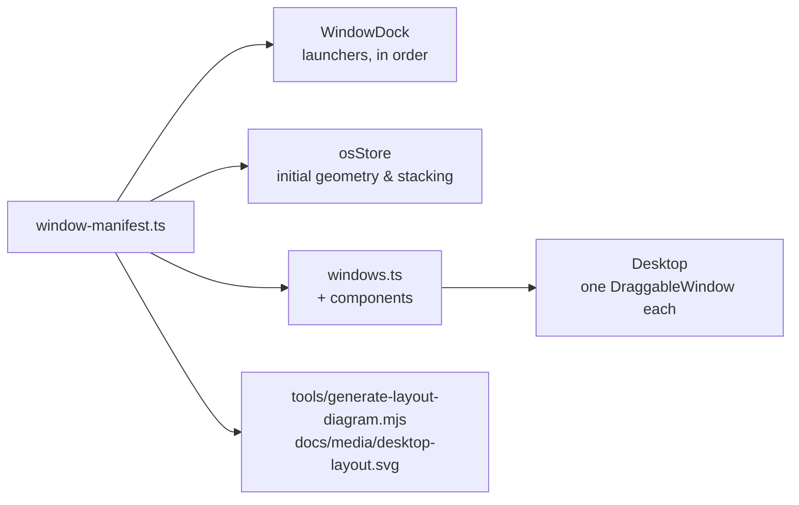

# The window system

DAEDALUS ships its own miniature window manager: ~150 lines of chrome, a
Zustand slice, and a manifest. This document explains how those fit together
and what it takes to add a window.

## The manifest

`src/config/window-manifest.ts` declares every window exactly once:

```ts
{
  id: 'oracle',                                     // stable key, member of WindowId
  title: 'ORACLE // DIVINATION',                    // chrome + dock tooltip
  summary: 'I Ching and tarot as a constrained…',   // docs and tooling
  icon: Compass,                                    // dock glyph
  accent: accent.amber,                             // themes chrome, glow, focus ring
  defaultGeometry: { x: 200, y: 200, width: 400, height: 300 },
  startsMinimised: true,                            // docked on first boot
}
```

Five consumers derive from that one array:



The diagram generator reads the manifest directly, and CI fails if the checked-in
SVG no longer matches — documentation that cannot silently rot.

### Why metadata and components are separated

`windows.ts` (metadata **+** components) is imported only by `Desktop` and the
tests. The store imports the metadata-only manifest. Without that split:

```
osStore → windows.ts → TerminalWindow → osStore
```

…is a cycle, and `WINDOW_MANIFEST` evaluates as `undefined` inside the store
depending on which module the bundler reaches first. See
[decisions/0001](decisions/0001-registry-driven-window-system.md).

## Runtime state

The manifest is immutable. Everything the user changes lives in the store, one
record per window:

```ts
interface WindowRuntimeState {
  id: WindowId;
  x;
  y;
  width;
  height: number; // current geometry
  minimised: boolean; // docked
  maximised: boolean;
  zIndex: number; // stacking; focused window owns the highest
  restoreGeometry: WindowGeometry | null; // captured before maximising
}
```

### Stacking

A monotonically increasing counter, not a sort. `focusWindow` assigns
`topZ + 1` and increments. Focusing an already-focused window is a no-op, so a
click on the active window costs zero renders.

Over a very long session the counter grows unbounded; at ~1 focus/second it
would take about 68 years to exhaust a 32-bit range, which is an acceptable
trade for O(1) focus.

### Geometry and the "lost window" problem

Naive drag handlers let you throw a window off-screen and lose it forever.
`clampWindowPosition` (in `src/lib/geometry.ts`) guarantees:

- the title bar never rises above the top bar (`y ≥ 52`);
- the title bar never sinks past the bottom edge;
- at least 96 px of window width stays horizontally on screen, in both
  directions.

Windows may still hang off the right and bottom edges — that is normal desktop
behaviour, and the constraint is specifically about keeping a grab area
reachable.

### Maximise and restore

`toggleMaximise(id, viewport)` stores the pre-maximise geometry in
`restoreGeometry` and fills the desktop area below the top bar. Restoring puts
back the exact rectangle and clears the field. Round-tripping is asserted in
`tests/unit/os-store.test.ts`.

Double-clicking the title bar does the same thing. Dragging is disabled while
maximised, because a maximised window that can be dragged out of alignment is
just a badly-sized window.

## Window chrome

`src/components/window/DraggableWindow.tsx` owns everything outside the window
body.

### Dragging

Pointer events with pointer capture, not mouse events on `window`:

```
pointerdown  →  focus, record grab offset, setPointerCapture
pointermove  →  moveWindow(id, clientX - offsetX, clientY - offsetY, viewport)
pointerup    →  release
```

This gets touch and stylus support for free, keeps events flowing when the
cursor outruns the title bar, and cleans up automatically if the browser
cancels the gesture. A `dragging` ref — not `hasPointerCapture` — is the source
of truth, so the interaction still works where the capture API is missing
(jsdom, older browsers).

Clicks that originate on a control button are ignored by the drag handler, so
minimise/maximise/close never start a drag.

### Controls

| Control  | Behaviour                                    |
| -------- | -------------------------------------------- |
| Minus    | Dock the window.                             |
| Maximise | Fill the desktop; the icon flips to restore. |
| ✕        | **Also docks.** Windows are never destroyed. |

The close button is honest about that: its accessible label reads
"Dismiss … to the dock". Destroying a window would mean losing its local state
(your manifesto draft, your starred books) with no undo, and the fiction says
these programs are always running.

All three carry `aria-label`s, the window is a labelled `<section>` (an
accessible `region`), and the dock exposes `aria-pressed` — which is what the
integration tests query by, rather than CSS classes.

## Adding a window

Three steps.

**1. Write the component** — `src/windows/EntropyWindow.tsx`:

```tsx
export function EntropyWindow() {
  return (
    <div
      className="h-full flex flex-col p-3 font-mono text-xs"
      style={{ color: '#ff6b6b', background: 'rgba(0,0,0,0.3)' }}
    >
      …
    </div>
  );
}

export default EntropyWindow;
```

Conventions: no props; `h-full` so the body fills the chrome; keep content
inside the accent colour you are about to declare; put any authored text in
`src/data/`.

**2. Add the id** — `src/types/os.ts`:

```ts
export type WindowId = 'terminal' | … | 'entropy';
```

**3. Declare it** — append to `WINDOW_MANIFEST`, then map the component in
`COMPONENTS` in `src/config/windows.ts`. TypeScript will refuse to compile
until both are done, because both are `Record<WindowId, …>`.

Then:

```bash
npm run docs:diagram   # refresh the layout SVG
npm run validate       # format, lint, types, tests, build
```

The registry test in `tests/unit/os-store.test.ts` will already be checking
your entry: unique id, non-empty title and summary, valid hex accent, sane
default geometry, a real component.

## Deliberate limitations

Documented rather than hidden — these are the honest edges of a small window
manager.

| Limitation                       | Why it stands                                                                                                                |
| -------------------------------- | ---------------------------------------------------------------------------------------------------------------------------- |
| No resize handles                | Every window is designed at a specific size. Maximise covers the "I need room" case.                                         |
| No snapping or tiling            | Would fight the hand-placed default layout.                                                                                  |
| Layout is not persisted          | Booting identically every time is part of the piece — see [decisions/0002](decisions/0002-zustand-kernel-no-persistence.md). |
| Default layout assumes ≥ 1400 px | The desktop metaphor does not survive a phone screen; see [roadmap](roadmap.md).                                             |
| Window bodies scroll, not reflow | Interiors are fixed compositions, not responsive layouts.                                                                    |
